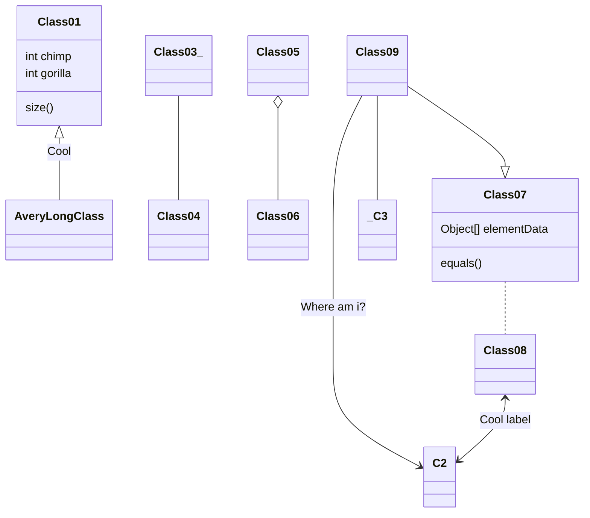
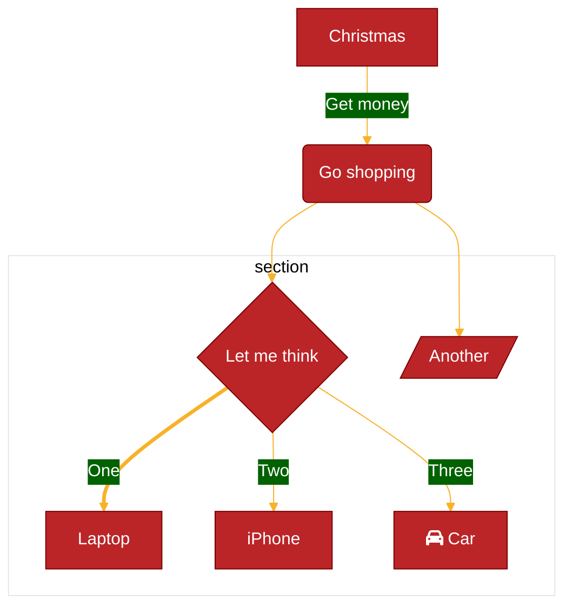

## Sample Text

### Third-level header

#### Fourth-level header

A paragraph (with a footnote):

**Lorem ipsum** dolor sit amet, consectetur adipiscing elit, sed do eiusmod
tempor incididunt ut labore et dolore *magna aliqua*. Ut enim ad minim veniam,
quis nostrud exercitation ullamco laboris nisi ut aliquip ex ea commodo
consequat. ==Duis== aute ~~irure~~ dolor in reprehenderit in voluptate velit esse cillum
dolore eu fugiat nulla pariatur. Excepteur sint occaecat cupidatat non proident,
sunt in culpa qui officia deserunt mollit anim id est laborum.[^1]

[^1]: I'm sure you are bored by the text here.

List:

1. item1
2. item2
3. item3
   - style1
   - style2
   - style3
4. item4 

A blockquote (a gray bar at the left and lightgray background):

> Quisque mattis volutpat lorem vitae feugiat. Praesent porta est quis porta
> imperdiet. Aenean porta, mi non cursus volutpat, mi est mollis libero, id
> suscipit orci urna a augue. In fringilla euismod lacus, vitae tristique massa
> ultricies vitae. Mauris accumsan ligula tristique, viverra nulla sed, porta
> sapien. Vestibulum facilisis nec nisl blandit convallis. Maecenas venenatis
> porta malesuada. Ut ac erat tortor. Orci varius natoque penatibus et magnis
> dis parturient montes, nascetur ridiculus mus. Nulla sodales quam sit amet
> tincidunt egestas. In et turpis at orci vestibulum ullamcorper. Aliquam sed
> ante libero. Sed hendrerit arcu lacus.
> 
> --- by Someone

(Em dash automatically right-aligned)

GitHub style alerts：

> [!NOTE]
> Useful information that users should know, even when skimming content.

> [!TIP]
> Helpful advice for doing things better or more easily.

> [!IMPORTANT]
> Key information users need to know to achieve their goal.

> [!WARNING]
> Urgent info that needs immediate user attention to avoid problems.

> [!CAUTION]
> Advises about risks or negative outcomes of certain actions.

A full-width table:

| Sepal.Length | Sepal.Width | Petal.Length | Petal.Width | Species |
|-------------:|------------:|-------------:|------------:|:--------|
|          5.1 |         3.5 |          1.4 |         0.2 | setosa  |
|          4.9 |         3.0 |          1.4 |         0.2 | setosa  |
|          4.7 |         3.2 |          1.3 |         0.2 | setosa  |
|          4.6 |         3.1 |          1.5 |         0.2 | setosa  |
|          5.0 |         3.6 |          1.4 |         0.2 | setosa  |
|          5.4 |         3.9 |          1.7 |         0.4 | setosa  |

An image:

<div align=center></div>


Display math (render by MathJax):

$$
|x| = \begin{cases} x & \text{if } x \geq 0 \\ -x & \text{if } x < 0  \end{cases}
$$

$$
\varlimsup_{n \to \infty}
$$

Inline math:

ni $ a^*=x-b^* $ hao

Definition list:

Apple
:   Pomaceous fruit of plants of the genus Malus in 
    the family Rosaceae.

Orange
:   The fruit of an evergreen tree of the genus Citrus.

## [Another Section](https://www.baidu.com)

Inline code and `<kbd>` style:

How about <kbd>Ctrl</kbd> + <kbd>C</kbd> and <kbd>Ctrl</kbd> + <kbd>V</kbd>?

Codeblock display:

```go
// GetTitleFunc returns a func that can be used to transform a string to title case.
// The supported styles are
// - "Go" (strings.Title)
// - "AP" (see https://www.apstylebook.com/)
// - "Chicago" (see https://www.chicagomanualofstyle.org/home.html)
func GetTitleFunc(style string) func(s string) string {
  switch strings.ToLower(style) {
  case "go":
    return strings.Title
  case "chicago":
    return transform.NewTitleConverter(transform.ChicagoStyle)
  default:
    return transform.NewTitleConverter(transform.APStyle)
  }
}
```

```diff
- pnpm add -D vuepress@next
+ pnpm add -D vuepress@next @vuepress/client@next vue
```

Mermaid:






Abcjs:


X: 1
T: Cooley's
M: 4/4
L: 1/8
K: Emin
|:D2|"Em"EBBA B2 EB|\
    ~B2 AB dBAG|\
    "D"FDAD BDAD|\
    FDAD dAFD|
"Em"EBBA B2 EB|\
    B2 AB defg|\
    "D"afe^c dBAF|\
    "Em"DEFD E2:|
|:gf|"Em"eB B2 efge|\
    eB B2 gedB|\
    "D"A2 FA DAFA|\
    A2 FA defg|
"Em"eB B2 eBgB|\
    eB B2 defg|\
    "D"afe^c dBAF|\
    "Em"DEFD E2:|



X:1
K:D
DD AA|BBA2|


---Hope you will enjoy it.
